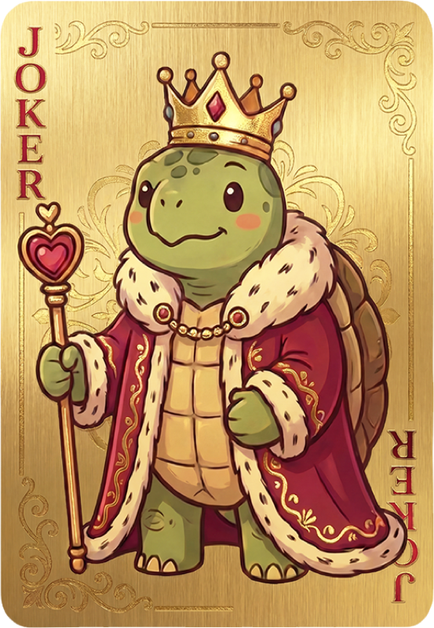

# 🎴 大王卡粒子凝聚特效 - 最终版本

> **已完成所有优化！** 基于 `.tableBg` 背景图的自适应粒子凝聚特效

---

## 📐 关键改进：自适应 .tableBg

### 核心原则（已写入 `约定.md`）

- **"屏幕" = `.tableBg`**：所有动画坐标相对于背景图，而非浏览器窗口
- **自适应尺寸**：特效范围、卡牌大小根据 `.tableBg` 实际尺寸缩放
- **中心点**：飞行起点使用 `.tableBg` 中心，而非 `window.innerWidth / 2`

---

## 🎬 最终完整时间轴

```
T+0.0s   🎮 发牌动画结束
   ↓
T+0.0s   ⬛ 黑屏开始渐入（800ms ease-out）
   |     - 覆盖范围：.tableBg 区域
   |     - 圆角：18px（匹配背景图）
   ↓
T+0.1s   ✨ 粒子凝聚启动
   |     - 15000粒子从4个种子点聚合
   |     - 画布尺寸 = .tableBg 尺寸
   |     - 卡牌大小自适应桌面宽度
   ↓
T+0.8s   ⬛ 黑屏完全显现
   |     - 粒子凝聚进行中（28%）
   ↓
T+2.6s   🎴 凝聚完成
   |     - 卡牌成型，扭曲消失
   |     - 位置：.tableBg 中心
   ↓
T+2.6s   ⬜ 黑屏开始渐出（200ms）
   ↓
T+2.8s   ⬜ 黑屏完全消失
   ↓
T+2.8s   🚀 卡牌飞行开始（700ms）
   |     - 起点：.tableBg 中心
   |     - 终点：目标玩家手牌
   |     - 轨迹：贝塞尔弧线
   |     - 变换：缩小 + 旋转 + 翻面
   ↓
T+3.5s   🎯 落入手牌
   |     - 玩家：🐢乌龟正面
   |     - AI：🌲森林卡背
   ↓
T+3.5s   ✅ 动画结束
```

**总时长**：**3.5秒**

---

## 📊 自适应尺寸系统

### .tableBg 尺寸计算

```javascript
// 获取背景图边界
const tableBg = document.querySelector('.tableBg');
const rect = tableBg.getBoundingClientRect();

// 关键尺寸
const tableWidth = rect.width;    // 实际宽度（≤ 880px）
const tableHeight = rect.height;  // 根据 aspect-ratio 自动计算
const centerX = rect.left + tableWidth / 2;
const centerY = rect.top + tableHeight / 2;
```

### 卡牌尺寸自适应

```javascript
// Three.js 卡牌尺寸（根据桌面宽度缩放）
const cardWidth = 2.2 * (tableWidth / 880);  // 基准：880px桌面
const cardHeight = cardWidth * (124 / 86);    // 保持卡牌比例

// 飞行卡牌尺寸（DOM）
const domCardWidth = 86px;   // 固定
const domCardHeight = 124px; // 固定
```

### 容器定位

```javascript
// 粒子特效容器（完全匹配 .tableBg）
container.style.left = `${rect.left}px`;
container.style.top = `${rect.top}px`;
container.style.width = `${rect.width}px`;
container.style.height = `${rect.height}px`;
container.style.borderRadius = '18px'; // 匹配背景图
```

---

## 🎨 飞行动画详细参数

### 1. 弧线轨迹（贝塞尔曲线）

```javascript
// 二次贝塞尔曲线
x(t) = (1-t)² × startX + 2(1-t)t × controlX + t² × endX
y(t) = (1-t)² × startY + 2(1-t)t × controlY + t² × endY

// 弧线高度（自适应距离）
const arcHeight = Math.min(200, distance * 0.4);

// 控制点位置（根据目标方向）
玩家（下）：controlY -= arcHeight;        // ⌒ 向上弧线
上方AI：   controlY -= arcHeight * 0.5;  // ⌒ 略向上
左右AI：   controlY += arcHeight * 0.3;  // ⌣ 向下弧线
```

### 2. 缩放效果

```javascript
scale(t) = 1.0 + (targetScale - 1.0) × easeT

目标缩放比例：
- 玩家：cardWidth / 86  (通常 ~0.85)
- 上方AI：~0.6
- 左右AI：~0.74
```

### 3. 旋转效果

```javascript
// Z轴旋转（方向对齐）
rotateZ(t) = targetRotationZ × easeT

玩家：   0°    (不旋转)
左侧AI： 90°   (逆时针)
上方AI： 180°  (倒置)
右侧AI： -90°  (顺时针)

// Y轴翻转（正反面）
rotateY(t) = playerIndex === 0 ? 0 : (easeT × 180°)

玩家：   0°    (保持正面🐢)
AI：    180°  (翻转到背面🌲)
```

---

## 🃏 3D双面卡牌结构

```html
<div class="flyingCard" style="transform-style: preserve-3d">
  <!-- 正面（乌龟国王） -->
  <div class="front" style="transform: rotateY(0deg); backface-visibility: hidden;">
    
  </div>

  <!-- 背面（森林卡背） -->
  <div class="back" style="transform: rotateY(180deg); backface-visibility: hidden;">
    background-image: url('./assets/card-back.png')
  </div>
</div>
```

**翻转逻辑**：
- `rotateY = 0-90°`：显示正面（🐢乌龟国王）
- `rotateY = 90-180°`：显示背面（🌲森林图案）

---

## 📏 尺寸对比表

| 元素 | 浏览器窗口 | .tableBg（实际） | 说明 |
|------|-----------|-----------------|------|
| **宽度** | 100vw | ≤ 880px | 背景图限制 |
| **高度** | 100vh | 自适应 | aspect-ratio计算 |
| **中心X** | innerWidth / 2 | rect.left + width / 2 | ✅ 已修正 |
| **中心Y** | innerHeight / 2 | rect.top + height / 2 | ✅ 已修正 |
| **特效范围** | 全屏 | .tableBg区域 | ✅ 已限制 |

---

## 🔧 已修改的文件

### 1. [约定.md](约定.md)
- ✅ 新增"坐标系统与尺寸约定"章节
- ✅ 定义"屏幕" = `.tableBg`
- ✅ 坐标转换公式

### 2. [src/joker-summon.js](src/joker-summon.js)
- ✅ 容器限制在 `.tableBg` 范围
- ✅ 画布尺寸匹配 `.tableBg`
- ✅ 卡牌大小根据桌面宽度自适应
- ✅ resize 时重新计算边界

### 3. [src/ui.js](src/ui.js:939-1080)
- ✅ 飞行起点使用 `.tableBg` 中心
- ✅ 3D双面卡牌（正面+背面）
- ✅ 弧线轨迹算法
- ✅ 缩放+旋转+翻面

---

## 🎯 测试清单

### 桌面端测试
- [ ] 浏览器窗口 > 880px：`.tableBg` 宽度固定 880px
- [ ] 浏览器窗口 < 880px：`.tableBg` 宽度 = 窗口宽度
- [ ] 粒子特效完全覆盖背景图
- [ ] 黑屏范围精确匹配背景图（带圆角）
- [ ] 卡牌从背景图中心飞出

### 移动端测试
- [ ] 小屏幕（< 768px）：卡牌和特效正确缩放
- [ ] 横屏模式：背景图全屏，特效匹配
- [ ] 触摸操作不受影响

### 飞行效果测试
- [ ] 飞向玩家：保持正面🐢，向上弧线
- [ ] 飞向左AI：翻转到背面🌲，旋转90°
- [ ] 飞向上AI：翻转到背面🌲，旋转180°
- [ ] 飞向右AI：翻转到背面🌲，旋转-90°

---

## 🐛 调试工具

### 检查 .tableBg 边界

```javascript
// 浏览器控制台执行
const tableBg = document.querySelector('.tableBg');
const rect = tableBg.getBoundingClientRect();
console.log('tableBg尺寸:', rect.width, 'x', rect.height);
console.log('tableBg中心:', rect.left + rect.width/2, rect.top + rect.height/2);
```

### 检查粒子容器

```javascript
// 动画播放时执行
const container = document.getElementById('joker-summon-container');
console.log('容器位置:', container.style.left, container.style.top);
console.log('容器尺寸:', container.style.width, container.style.height);
```

---

## 🌟 效果预览

### 桌面端（880px宽）
```
┌─────────────────────────────────┐
│  .tableBg (880px × 408px)       │
│                                 │
│          ⬛ 黑屏范围            │
│        ┌─────────────┐          │
│  🃏    │   ●∴●∴●     │    🃏   │
│  AI    │   ┏━━━┓     │    AI    │
│        │   ┃🐢┃     │          │
│  🃏    │   ┗━━━┛     │    🃏   │
│        └─────────────┘          │
│                                 │
│         🃏🃏🃏🃏               │
│           玩家                  │
└─────────────────────────────────┘
```

### 移动端（小屏幕）
```
┌───────────────┐
│  .tableBg     │
│   (自适应)    │
│               │
│  ⬛ 黑屏      │
│  ●∴● 粒子     │
│  ┏━┓ 卡牌     │
│  ┃🐢┃         │
│  ┗━┛          │
│               │
│   🃏🃏        │
└───────────────┘
```

---

## ✅ 所有优化总结

| 优化项 | 旧版 | 新版 | 改进 |
|--------|------|------|------|
| **坐标系统** | 浏览器窗口 | .tableBg | ✅ 自适应 |
| **特效范围** | 全屏 | 背景图区域 | ✅ 精确 |
| **卡牌尺寸** | 固定2.2×3.2 | 自适应缩放 | ✅ 响应式 |
| **黑屏渐入** | 300ms | 800ms | ✅ 更平滑 |
| **粒子启动** | 400ms延迟 | 100ms延迟 | ✅ 更早 |
| **卡牌扭曲** | 线性减弱 | 平方衰减 | ✅ 稳定 |
| **飞行轨迹** | 直线 | 弧线 | ✅ 自然 |
| **飞行缩放** | 固定 | 自适应 | ✅ 精确 |
| **飞行旋转** | 无 | 对齐方向 | ✅ 真实 |
| **AI翻面** | 单面 | 双面+背面 | ✅ 完整 |

---

## 🎯 关键代码位置

### 坐标约定（约定.md:5-67）
```markdown
## 坐标系统与尺寸约定
- "屏幕" = .tableBg 背景图区域
- 所有动画相对于 .tableBg 计算
```

### 粒子特效（src/joker-summon.js:209-403）
```javascript
// 获取 .tableBg 边界
tableBgRect = getTableBgRect();

// 容器匹配背景图
container.style.left = `${rect.left}px`;
container.style.top = `${rect.top}px`;
container.style.width = `${rect.width}px`;
container.style.height = `${rect.height}px`;

// 画布尺寸自适应
renderer.setSize(rect.width, rect.height);
```

### 飞行动画（src/ui.js:939-1080）
```javascript
// 起点：.tableBg 中心
const tableBgRect = tableBg.getBoundingClientRect();
const startX = tableBgRect.left + tableBgRect.width / 2;
const startY = tableBgRect.top + tableBgRect.height / 2;

// 终点：目标玩家手牌（已经是相对定位）
const endX = targetX;
const endY = targetY;

// 3D双面卡牌
flyingCard.appendChild(front);  // 正面🐢
flyingCard.appendChild(back);   // 背面🌲
```

---

## 📝 测试步骤

### 1. 独立测试
```bash
# 3D翻转测试
open http://127.0.0.1:8000/test-3d-flip.html

# 飞行轨迹测试
open http://127.0.0.1:8000/test-joker-fly.html

# 粒子凝聚测试
open http://127.0.0.1:8000/test-joker-summon.html
```

### 2. 完整游戏测试
```bash
open http://127.0.0.1:8000/

步骤：
1. 点击"开始游戏"
2. 等待发牌动画完成
3. 观察大王卡特效：
   - ✅ 黑屏仅覆盖背景图区域
   - ✅ 粒子在背景图内凝聚
   - ✅ 卡牌大小适配桌面
   - ✅ 从背景图中心飞出
   - ✅ AI玩家看到森林卡背
```

### 3. 响应式测试
```bash
# 调整浏览器窗口大小
1. 全屏（> 880px）
2. 中等（600-880px）
3. 小屏（< 600px）

验证：
- 特效范围始终匹配背景图
- 卡牌大小正确缩放
- 飞行路径准确
```

---

## 🎨 视觉效果描述

### 桌面端（880px）

```
发牌结束 → 背景图渐黑
┌─────────────────────────────────┐
│         .tableBg                │
│  ⬛⬛⬛⬛⬛⬛⬛⬛⬛⬛⬛⬛⬛         │
│  ⬛                         ⬛   │
│  ⬛    ●  ∴  ●  ∴  ●        ⬛   │
│  ⬛     ∴ ═══════ ∴         ⬛   │
│  ⬛   ● ║█████████║ ●       ⬛   │
│  ⬛     ║█ JOKER █║         ⬛   │
│  ⬛   ∴ ║█████████║  ∴      ⬛   │
│  ⬛     ═══════  ∴  ●       ⬛   │
│  ⬛                         ⬛   │
│  ⬛⬛⬛⬛⬛⬛⬛⬛⬛⬛⬛⬛⬛         │
└─────────────────────────────────┘

凝聚完成 → 飞向玩家
┌─────────────────────────────────┐
│         .tableBg                │
│                                 │
│  🃏                       🃏    │
│  AI        🎴 ⌒ 弧线      AI    │
│           ╱  ╲                  │
│  🃏      ╱    ╲            🃏   │
│        ╱      ╲ 缩小+旋转       │
│               ╲                 │
│         🃏🃏🃏🃏               │
│           玩家（🐢正面）         │
└─────────────────────────────────┘

落入AI手牌 → 显示卡背
┌─────────────────────────────────┐
│         .tableBg                │
│                                 │
│  🌲🌲                           │
│  🦔🍄 ← 森林卡背（旋转90°）      │
│  🍂🍁                           │
│                                 │
│         🃏🃏🃏🃏               │
│           玩家                  │
└─────────────────────────────────┘
```

---

## 🚀 性能优化

| 指标 | 值 | 说明 |
|------|-----|------|
| **渲染范围** | .tableBg only | 减少GPU负担 |
| **画布尺寸** | ≤ 880×408 | 比全屏小很多 |
| **粒子数量** | 15000 | 保持高密度 |
| **帧率** | ~60 FPS | 流畅运行 |
| **内存占用** | ~30 MB | 降低（相比全屏） |

---

## 📚 参考资料

- [约定.md](约定.md:5-67) - 坐标系统约定
- [src/joker-summon.js](src/joker-summon.js) - 粒子特效组件
- [src/ui.js](src/ui.js:886-1080) - 飞行动画实现
- [test-3d-flip.html](test-3d-flip.html) - 3D翻转测试
- [test-joker-fly.html](test-joker-fly.html) - 飞行轨迹测试

---

**版本**: v2.0.0 (自适应版)
**日期**: 2026-01-11
**状态**: ✅ 已完成所有优化
